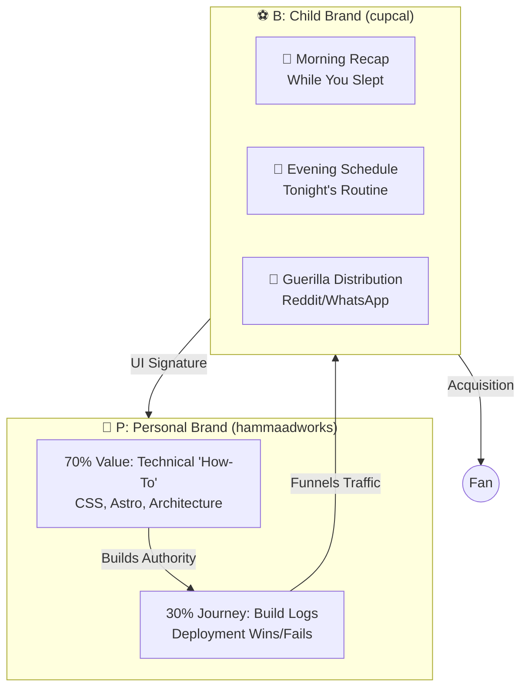

# 🗺️ Architecture & Data Flow

This document visualizes the complete ecosystem of `cupcal.online`.

## 1. System Architecture & Entity Flow

```mermaid
graph TB
    subgraph Users["👥 User Entities"]
        Fan[⚽ Football Fan]
        Sponsor[💼 Community Sponsor]
    end

    subgraph CDN["🌍 Vercel Edge Network (Frontend)"]
        Edge[⚡ Edge Middleware <br/>(Geo-IP Detection)]
        SSG[🖥️ Astro SSG <br/>(HTML/CSS/Vanilla JS)]
        MatchPage[📑 Match Detail Pages <br/>(SEO/Countdown)]
        CountrySel[🌍 Country Selector <br/>(Localized Timing)]
    end

    subgraph Client["📱 Client-Side Features"]
        Alerts[⏰ Advanced Alert Center <br/>(Multi-Alert ICS)]
        Gen[🖼️ Status/Story Generator <br/>(Teaser Graphics)]
        Export[📥 Branded Downloads <br/>(Personalized PNG)]
    end

    subgraph Data["💾 Data & Analytics (Self-Hosted)"]
        Umami[📊 Umami Analytics Engine]
        NeonDB[(🐘 Neon Analytics DB)]
        SupabaseDB[(🟢 Supabase Project DB)]
    end

    subgraph External["🔌 External Integrations"]
        Turnstile[🛡️ Cloudflare Turnstile <br/>(Anti-Bot)]
        Resend[✉️ Resend <br/>(Manual ROI Reports)]
        Razorpay[💳 Razorpay]
    end

    %% --- Fan Core Loop ---
    Fan -->|Visits Site| Edge
    Edge -->|Injects Local Sponsor| SSG
    SSG -->|Displays UI| CountrySel
    CountrySel -->|Filters List| Fan
    Fan -->|Views Detail| MatchPage
    MatchPage -->|Sets Multi-Alerts| Alerts
    Alerts -->|Native .ics| Fan
    Fan -->|Shares| Gen
    Fan -->|Downloads| Export

    %% --- Tracking Loop ---
    Fan -.->|Pageviews & Clicks| Umami
    Umami -.->|Writes| NeonDB
```

---

## 2. Micro-Flows & Cash Flow

### A. The Cash Flow (Sponsor Payment)
1. Sponsor clicks "Become a Patron" -> Redirected to **Razorpay**.
2. Sponsor submits creative and target location.
3. Admin reviews -> Approves -> Live.

### B. The Data Flow
* **`ics` generation:** 100% Client-side. Supports multiple `VALARM` blocks per event.
* **Branded Downloads:** 100% Client-side using HTML Canvas.
* **Spoiler Shield:** 100% Client-side (`localStorage`).
* **Ad Fallback Logic:** Edge Middleware holds a lightweight cache. If Supabase DB query is slow, it defaults to an internal promo.

---

## 3. PB Content Flow (Brand Architecture)

The following diagram visualizes how content flows between the personal brand and the product.


